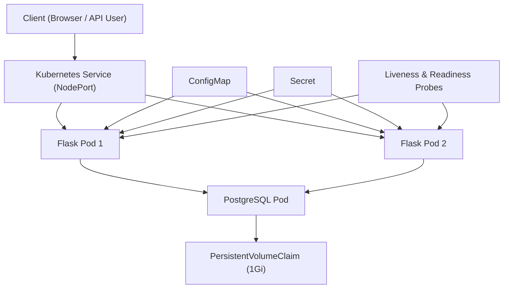

# 🚀 DevOps Microservices Project


A production-style microservices backend built with **Flask + PostgreSQL**, containerized using Docker and deployed to **Kubernetes (Kind)** with scaling, health probes, secrets, and rolling updates.

This project demonstrates hands-on DevOps practices from containerization, orchestration, scaling, to zero-downtime deployments using Kubernetes.
---

## 🏗 Architecture Overview

### 📊 Kubernetes Architecture Diagram



---

### 🔹 Docker Compose Architecture (Phase 2)
Client
→ Flask Backend (Container)
→ PostgreSQL (Container)
→ Persistent Docker Volume
- Internal service discovery using Docker networking  
- Automated DB initialization  
- Multi-container orchestration  

---


### ☸️ Kubernetes Architecture (Phase 3)
Client
→ Kubernetes Service (NodePort / Port-Forward)
→ Flask Backend Pods (2 replicas)
→ PostgreSQL Pod
→ PersistentVolumeClaim (1Gi storage)
- Service-based internal DNS (`DB_HOST=postgres`)
- Horizontal scaling with replicas
- Persistent storage using PVC
- ConfigMap for configuration
- Secret for credentials
- Rolling updates with zero downtime

---

## 📌 Phase 1 – Flask + PostgreSQL Backend

- REST API built with Flask  
- PostgreSQL integration using psycopg2  
- Environment-based configuration  
- Health check endpoint (`/health`)  

---

## 🐳 Phase 2 – Dockerized Multi-Container Setup

- Backend containerized using Docker  
- PostgreSQL containerized  
- Multi-container orchestration using Docker Compose  
- Persistent volume for DB storage  
- Automated database initialization  
- Service-based container networking  

#### ▶️ Run Locally
docker compose up --build

#### Access:
- http://localhost:5000/health
- http://localhost:5000/tasks

## ☸️ Phase 3 – Kubernetes Deployment (Kind)

Deployed to a local Kubernetes cluster using Kind.

Implemented:
- PostgreSQL Deployment
- PersistentVolumeClaim (1Gi storage)
- ClusterIP Service for internal DB communication
- Flask Backend Deployment
- NodePort Service for external access
- Liveness & Readiness Probes
- ConfigMap for environment configuration
- Secret for database credentials
- Horizontal scaling (2 replicas)
- Rolling update (v1 → v2)
- Zero-downtime deployment

#### Apply Kubernetes manifests:
- kubectl apply -f k8s/

#### Port-forward to access locally:
- kubectl port-forward service/flask-backend 5000:5000

## 🔄 Rolling Update Demonstration 

The backend was upgraded from:
- devops-project-backend:latest

to:
- devops-project-backend:v2

Kubernetes performed a rolling update:
- New ReplicaSet created
- New pods started
- Old pods terminated gradually
- No downtime during deployment

#### Rollback can be performed using:
- kubectl rollout undo deployment flask-backend

## 🚀 API Endpoints 
| Method | Endpoint | Description       |
| ------ | -------- | ----------------- |
| GET    | /health  | Health check      |
| GET    | /tasks   | Fetch all tasks   |
| POST   | /tasks   | Create a new task |

## 🛠 Tech Stack 

- Python (Flask)
- PostgreSQL
- Docker
- Docker Compose
- Kubernetes (Kind)
- YAML (Infrastructure as Code)
- Git & GitHub

## ♾️ DevOps Concepts Demonstrated 

- Containerization with Docker
- Multi-container orchestration
- Kubernetes Deployments & Services
- PersistentVolumeClaims (stateful workloads)
- Liveness & Readiness Probes
- ConfigMap & Secret management
- Horizontal scaling
- Rolling updates
- ReplicaSets
- Service-based load balancing
- Declarative Infrastructure

## 📂 Project Structure

```
devops-project/
├── backend/
│   ├── app.py
│   ├── Dockerfile
│   └── requirements.txt
├── k8s/
│   ├── postgres-deployment.yaml
│   ├── postgres-service.yaml
│   ├── postgres-pvc.yaml
│   ├── backend-deployment.yaml
│   ├── backend-service.yaml
│   ├── backend-configmap.yaml
│   └── backend-secret.yaml
└── docker-compose.yml
```

## 🎯 Future Improvements

- CI/CD pipeline using GitHub Actions
- Deploy to AWS EKS
- Infrastructure as Code using Terraform
- Add Ingress Controller
- Implement HPA (Horizontal Pod Autoscaler)
- Monitoring with Prometheus & Grafana

## 🔥 What This Project Shows

This project demonstrates practical DevOps skills:
- Building containerized applications
- Deploying to Kubernetes
- Managing configuration securely
- Scaling applications
- Performing zero-downtime deployments
- Debugging real infrastructure issues