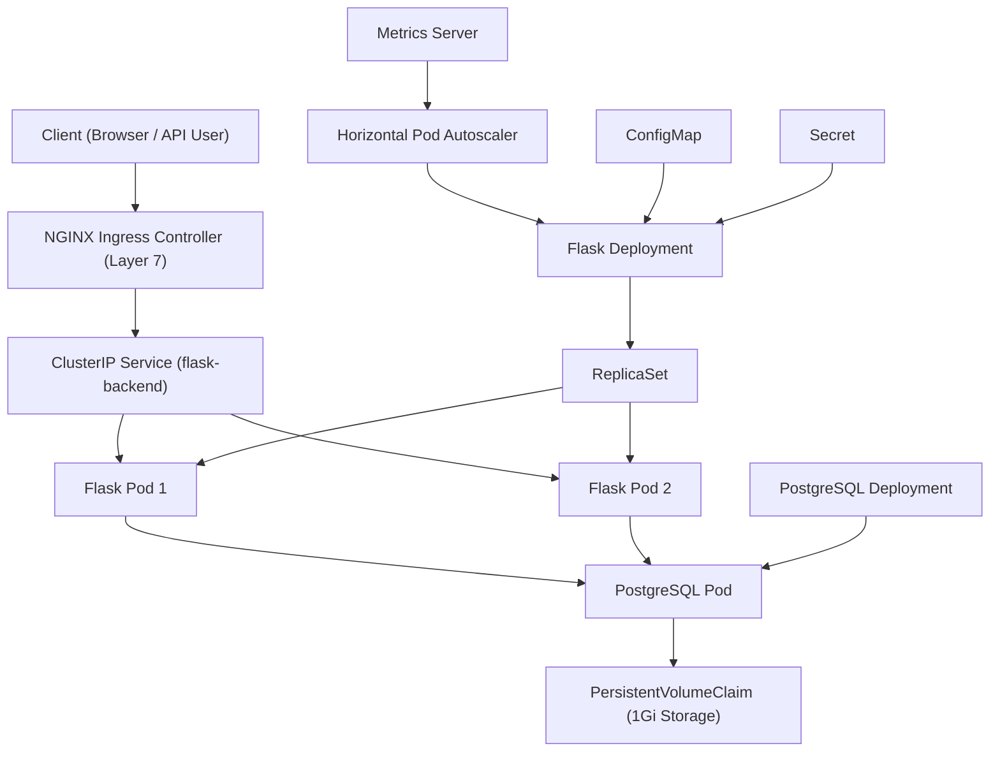

	# 🚀 DevOps Microservices Project


A production-style microservices backend built with Flask + PostgreSQL, containerized using Docker and deployed to Kubernetes (Kind) with Ingress, auto-scaling, health probes, secrets management, and CI/CD automation.

This project demonstrates hands-on DevOps practices from containerization to orchestration, scaling, and zero-downtime deployments.

---

## 🏗 Architecture Overview

### 📊 Kubernetes Architecture Diagram
## 📊 Kubernetes Production Architecture Diagram


```mermaid
flowchart TD

    Client["Client (Browser / API User)"]
    Client --> Ingress["NGINX Ingress Controller (Layer 7)"]

    Ingress --> Service["ClusterIP Service (flask-backend)"]

    Service --> Pod1["Flask Pod 1"]
    Service --> Pod2["Flask Pod 2"]

    Deployment["Flask Deployment"] --> RS["ReplicaSet"]
    RS --> Pod1
    RS --> Pod2

    HPA["Horizontal Pod Autoscaler"] --> Deployment
    Metrics["Metrics Server"] --> HPA

    Pod1 --> DBPod["PostgreSQL Pod"]
    Pod2 --> DBPod

    DBDeployment["PostgreSQL Deployment"] --> DBPod
    DBPod --> PVC["PersistentVolumeClaim (1Gi Storage)"]

    Config["ConfigMap"] --> Deployment
    Secret["Secret"] --> Deployment
```

---
##📌 Project Phases
---

## 🧩 Phase 1 – Flask + PostgreSQL Backend

- REST API built with Flask  
- PostgreSQL integration using psycopg2  
- Environment-based configuration  
- Health check endpoint (`/health`)  
- Task creation and retrieval endpoints (/tasks)

#### API Endpoints

| Method | Endpoint | Description       |
| ------ | -------- | ----------------- |
| GET    | /health  | Health check      |
| GET    | /tasks   | Fetch all tasks   |
| POST   | /tasks   | Create a new task |

---

## 🐳 Phase 2 – Dockerized Multi-Container Setup

- Backend containerized using Docker  
- PostgreSQL containerized  
- Multi-container orchestration using Docker Compose  
- Persistent Docker volume for database storage 
- Automated database initialization  
- Service-based container networking  

#### ▶️ Run Locally
```
docker compose up --build
```

#### Access:

- http://localhost:5000/health
- http://localhost:5000/tasks


## ☸️ Phase 3 – Kubernetes Deployment (Kind)

Deployed to a local Kubernetes cluster using Kind with production-style configuration.

Implemented Features:

- PostgreSQL Deployment with PersistentVolumeClaim (1Gi storage)
- Flask Backend Deployment
- ClusterIP Service for internal DB communication
- NGINX Ingress Controller (Layer 7 routing)
- Host-based routing (devops.local)
- Liveness & Readiness Probes
- ConfigMap for configuration management
- Secret for secure credential storage
- Horizontal Pod Autoscaler (HPA)
- Metrics Server for resource monitoring
- Rolling updates with zero downtime
- Versioned deployments using commit SHA tags

#### Apply Kubernetes manifests:
```
kubectl apply -f k8s/
```

#### Port-forward to access locally:
```
kubectl port-forward service/flask-backend 5000:5000
```

## 🔄 Rolling Update Demonstration 

The backend was upgraded from:
- devops-project-backend:latest

to:
- devops-project-backend:v2

Kubernetes performed a rolling update:
- New ReplicaSet created
- New pods started
- Old pods terminated gradually
- No downtime during deployment

#### Rollback can be performed using:
```
kubectl rollout undo deployment flask-backend

```

## 🔄 Phase 4 – CI/CD with GitHub Actions

Implemented a Continuous Integration pipeline using GitHub Actions.

CI Pipeline Workflow:

- Triggered on push to main
- Builds Docker image automatically
- Tags image with:
	- latest
	- Commit SHA (immutable versioning)
- Pushes images to Docker Hub

Example image tags:
```
ssacharitha/devops-project-backend:latest
ssacharitha/devops-project-backend:<commit-sha>
```
This enables: 
- Traceable deployments
- Safe rollbacks
- Immutable infrastructure practices

## 📈 Phase 5 – Auto Scaling with HPA

- Installed Metrics Server in Kubernetes
- Configured CPU resource requests & limits
- Implemented Horizontal Pod Autoscaler (HPA)
- Automatic scaling between 2–6 replicas
- Target CPU utilization: 50%

Observed behavior:

- Pods scale up automatically under load
- Scale down when traffic decreases
- No downtime during scaling events

## 🛠 Tech Stack 

- Python (Flask)
- PostgreSQL
- Docker
- Docker Compose
- Kubernetes (Kind)
- NGINX Ingress Controller
- GitHub Actions (CI/CD)
- YAML (Declarative Infrastructure)
- Git & GitHub

## ♾️ DevOps Concepts Demonstrated 

- Containerization with Docker
- Multi-container orchestration (Docker Compose)
- Kubernetes Deployments & Services
- Ingress (Layer 7 HTTP routing)
- PersistentVolumeClaims (stateful workloads)
- ConfigMap & Secret management
- Liveness & Readiness Probes
- Horizontal Pod Autoscaling (HPA)
- Metrics Server integration
- Rolling updates & zero-downtime deployments
- GitHub Actions CI/CD automation
- Commit-based image versioning
- Declarative Infrastructure (Infrastructure as Code using YAML)

## 📂 Project Structure

```
devops-project/
├── backend/
│   ├── app.py
│   ├── Dockerfile
│   └── requirements.txt
├── k8s/
│   ├── postgres-deployment.yaml
│   ├── postgres-service.yaml
│   ├── postgres-pvc.yaml
│   ├── backend-deployment.yaml
│   ├── backend-service.yaml
│   ├── backend-configmap.yaml
│   ├── backend-secret.yaml
│   ├── backend-ingress.yaml
│   └── backend-hpa.yaml
├── .github/
│   └── workflows/
│       └── docker-ci.yml
└── docker-compose.yml
```

## 🎯 Future Improvements

- Deploying to AWS EKS (Managed Kubernetes)
- Infrastructure provisioning using Terraform
- Monitoring with Prometheus & Grafana
- Adding centralized logging
Implementing full CD (auto deployment to cluster)

## 🔥 What This Project Shows

This project demonstrates practical DevOps capabilities:
- Designing containerized microservices
- Deploying to Kubernetes with production patterns
- Managing secrets and configuration securely
- Implementing CI/CD automation
- Enabling zero-downtime rolling deployments
- Implementing dynamic auto-scaling
- Debugging and resolving real infrastructure issues